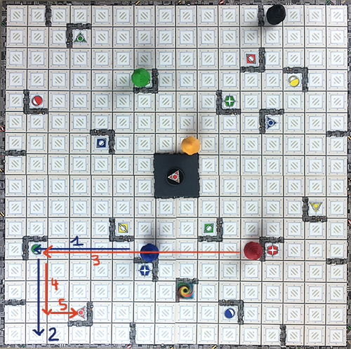
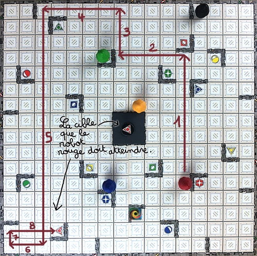

# SMP - TP10

# Graded Assignment - Ricochet Robots

The goal of this assignment is to implement the Ricochet Robots game by using the object concepts learned during the course.

## 1. Game Rules

[https://en.wikipedia.org/wiki/Ricochet_Robots](https://en.wikipedia.org/wiki/Ricochet_Robots)

Ricochet Robots is a board game where 4 robots can move on a 16 × 16 grid. The game is played in rounds, with each round consisting of moving the robots to reach one of the squares on the grid. The robots move in straight lines and always advance until they encounter the first wall, robot, or edge of the grid.

The game can be played solo or with a large number of participants. The game components include:

- 4 robots of different colors (red, yellow, blue, and green)
- 17 objectives distributed in four groups of four tiles with the same color as one of the robots, and one multicolored tile
- a 16 × 16 grid (see grid generation rules below)
- a 1-minute hourglass timer

In each round, one of the players flips over an objective tile. The goal is to move the robot with the color matching the tile to the objective square with the same symbol as the tile. If the multicolored tile is drawn, the objective is to move any robot to the multicolored square on the grid.

The players play simultaneously, each contemplating how to move the robot using the movement rules. When one of them believes to have found a solution, they announce the number of moves they plan to make to achieve the objective, and then they flip the hourglass.

The other players have until the end of the hourglass to propose better solutions using fewer moves.

After the hourglass runs out, the player with the solution requiring the fewest moves presents their solution and wins the tile. If they fail in their demonstration, the player who proposed the immediately higher number of moves presents their solution, and so on until a valid solution is found.

## 2. Movement Rules

On the grid, robots move in straight lines as far as possible before encountering an obstacle. During their turn, players can use the four robots as they wish (fig. 2.1).

Once set in motion, a robot cannot stop or change direction until it encounters an obstacle. The obstacles can be:

- the edges of the grid
- walls represented on the grid
- another robot

Each robot movement counts as one move, regardless of the number of squares traveled.

Note: If, after flipping an objective tile, it turns out that the solution is reachable in a single move, the players must ignore that solution and strive to find another one.

FIGURE 2.1 – Example of movements to reach one of the red targets. [[source]](https://www.lemonde.fr/blog/unmondedejeux/2016/05/28/et-si-on-jouait-a-ricochet-robots/)

## Grid Generation

The game grid is normally composed of 4 printed grid quarters on both sides, resulting in 96 different ways to arrange the grids. We will create a random grid generator to provide us with more grid possibilities than the original game, while still respecting certain rules.

1. Place the walls around the grid, including the walls that form the central square.
2. For the rest of the grid generation, we will work on each quarter separately. On each quarter, randomly place two outer walls, one vertical side and one horizontal side.
3. Next, add the inner walls. On each quarter, place 4 "corners" consisting of two walls each. Their placement is random, but make sure that a corner cannot touch another corner or an outer wall.
4. Once we have placed 2 outer walls and 4 "corners" per quarter, add a new "corner" of two walls in one of the randomly chosen quarters. This way, we obtain a grid containing 17 "corners" and 8 outer walls, just like the grids in the original game.
5. Randomly place the 4 robots. The choice of the target (red, green, blue, yellow, or multicolored) is also random, and its placement must be in one of the corners formed by two walls. In a game, there can be a maximum of 17 targets (4 of each color and 1 multicolored).

## Tasks to be Done

At the end of the assignment, the following is expected:

- A description of your game design in the form of a use case diagram and a class diagram.
- An implementation in C++ that allows multiple players to take turns playing, with a text-based display of grids, targets, and robots. The code should be documented.
- Demonstration of the proper functioning of different features through test cases.

The code should be documented, tested, and versioned on GitHub.